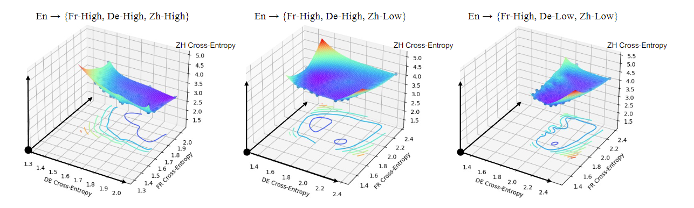

# On the Pareto Front of Multilingual Neural Machine Translation

In this repo, we provide the source code for you to reproduce the collapse of Pareto front phenomena and the visualization result as in our paper (https://arxiv.org/abs/2304.03216).

## Environment
```
conda create -n ParetoMNMT python=3.8.15
conda activate ParetoMNMT
bash setup.sh
```

## Reproduce the results
We provide the training scripts for reproducing the 2d and 3d trade-off front in our paper.

We also provide preprocessed binary data at [GoogleDrive](https://drive.google.com/drive/folders/1OudC-Af-TgVSdAqP5JTt7q_qqRmKq3JQ?usp=sharing), which is needed to conduct following training.

```
cd scripts
bash frdezh_trade_off.sh # 3d-trade-off front
bash frzh_trade_off.sh # 2d-trade-off front
# you can split the training to different GPU to speed up
```
The training log and checkpoint will be saved at `./logs` and `./checkpoints` directories. 

- you can also use the `scripts/inference.sh` to compute the BLEU score of each models 

```
cd scripts
bash inference.sh <checkpoint_dir> # you can change the inferenced directions in the script
```


## Visualization

We provide a jupyter notebook `./scripts/3d-vis.ipynb` to visulize the 3d Pareto front after training all models.

The results:

<div align=center>


<b>3d trade-off front of fr-de-zh with different data-adequacy
</b>

</div>

## Citation

Please kindly cite our paper if you find it helpful in your work.
```bib
@article{Chen2023OnTP,
  title={On the Pareto Front of Multilingual Neural Machine Translation},
  author={Liang Chen and Shuming Ma and Dongdong Zhang and Furu Wei and Baobao Chang},
  journal={ArXiv},
  year={2023},
  volume={abs/2304.03216}
}
```


